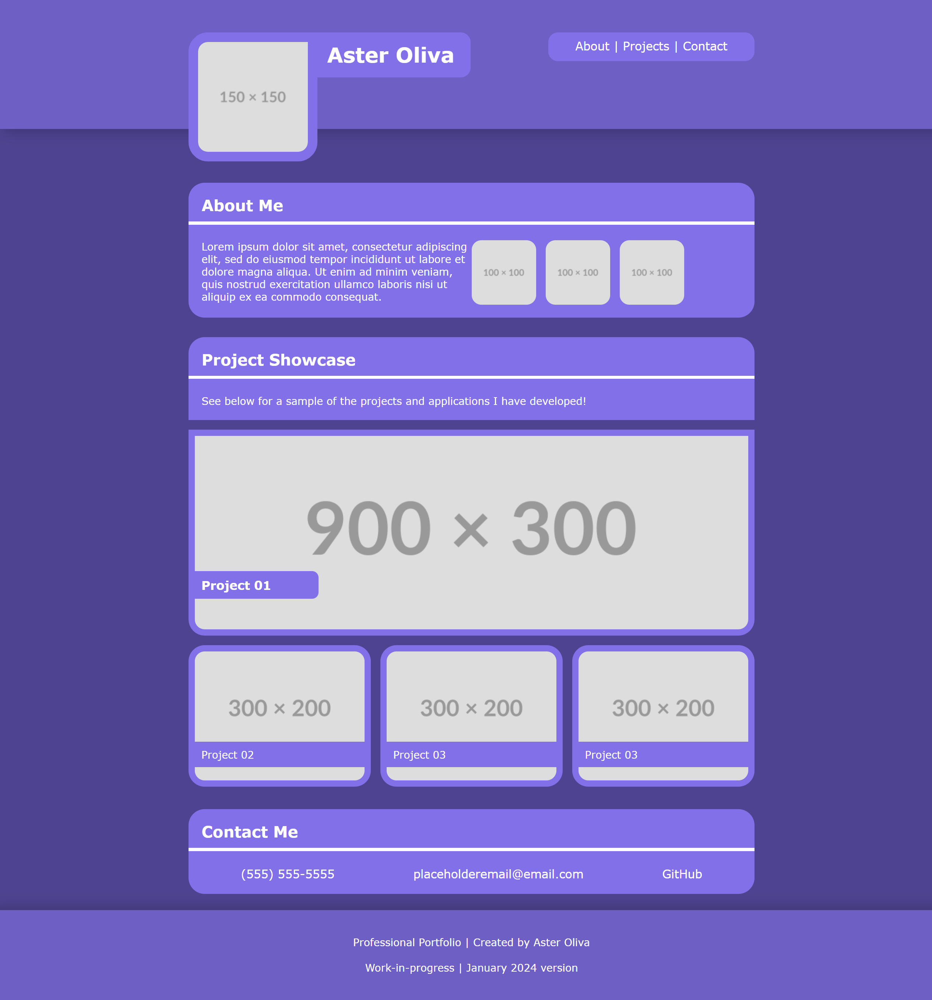

# professional-portfolio

## Project Description

A study in creating a responsive professional portfolio for future employers.

## Contents

- [Introduction](#introduction)
- [Problem](#problem)
- [Solution](#solution)
- [Deployment](#deployment)
- [Collaborators](#collaborators)
- [Resources](#resources)
- [License](#License)

## Introduction

For this project, I set out to create a professional portfolio to host my future projects and to show them to prospective future employers. I was given the parameters of ensuring that the portfolio had a responsive design utilizing CSS MediaQueries with specific breakpoints for desktop, tablet and mobile. I mocked up a custom design that I implemented in CSS, learning new techniques in order to achieve my desired visual layout.

## Problem

I was instructed to create this project from scratch, with the following requirements for content and functionality:

- GIVEN I need to sample a potential employee's previous work
- WHEN I load their portfolio
- THEN I am presented with the developer's name, a recent photo or avatar, and links to sections about them, their work, and how to contact them
- WHEN I click one of the links in the navigation
- THEN the UI scrolls to the corresponding section
- WHEN I click on the link to the section about their work
- THEN the UI scrolls to a section with titled images of the developer's applications
- WHEN I am presented with the developer's first application
- THEN that application's image should be larger in size than the others
- WHEN I click on the images of the applications
- THEN I am taken to that deployed application
- WHEN I resize the page or view the site on various screens and devices
- THEN I am presented with a responsive layout that adapts to my viewport

## Solution

I rectified the above problems in the following way:

- ( list actions taken to solve above problem. )
-
-

See below for a screenshot of the project.

## Deployment

[Link to the GitHub repo for this project](https://github.com/Aoliva96/professional-portfolio)

[Link to the deployed project on GitPages](https://aoliva96.github.io/professional-portfolio)

## Collaborators

I collaborated with ( student / instructor names.)
I made modifications to the following areas of my code while collaborating on this project with ( student / instructor names.).

-
-
-

## Resources

See the links below to see some of the resources I used for this project:

[link title placeholder](#)

I also referenced ( in class activity names/numbers ).

## License

This project utilizes the standard MIT License.
